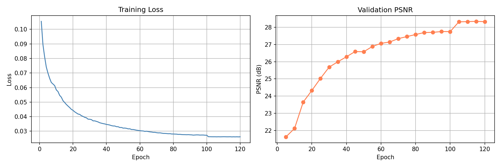

# HW4 — Image Restoration with PromptIR

**Visual Recognition using Deep Learning, Spring 2026**
**Student ID**: 111550005

## Introduction

This repository implements all-in-one image restoration for rain and snow degradation using [PromptIR (NeurIPS 2023)](https://arxiv.org/abs/2306.13090) as the backbone. A single model is trained from scratch to handle both degradation types without any prior knowledge of the degradation category.

### Key Design of PromptIR

PromptIR is a U-Net-style hierarchical Transformer with two core components:

- **MDTA (Multi-DConv Head Transposed Self-Attention)**: Applies attention across the channel dimension of transposed features, making it efficient for high-resolution inputs while capturing global context.
- **GDFN (Gated Depth-wise Feed-Forward Network)**: Uses a gating mechanism to control feature flow and suppress less useful activations.
- **Prompt Block**: At each decoder scale, learned prompt vectors are weighted by a degradation-aware embedding (global average pooling → softmax linear layer) and injected into decoder features, enabling a single model to handle multiple degradation types.

### Modifications Made

| # | Modification | Details | Motivation |
|---|---|---|---|
| 1 | **Channel Attention (SE Block)** | Added after each FFN in every Transformer block | Recalibrates channel-wise responses; helps focus on restoration-relevant features |
| 2 | **FFT Frequency Loss** | `L = L1 + 0.05 × L1(|FFT(pred)|, |FFT(target)|)` | Supervises high-frequency detail recovery (edges, textures) |
| 3 | **Longer Prompt (5→10)** | Prompt length increased from 5 to 10 per scale | Richer degradation-specific encoding capacity |
| 4 | **Learnable Residual Scaling** | Scalar init=0.1 on FFN residual branch | Stabilizes early-epoch training |

### Inference Enhancement

- **8-fold D4 TTA**: At inference time, predictions from 4 rotations × (original + hflip) are averaged, consistently improving PSNR by ~0.3 dB.
- **np.rint rounding**: Uses round-half-up instead of floor truncation when converting to uint8, eliminating systematic −0.5 LSB bias.

## Environment Setup

```bash
pip install torch torchvision einops pillow tqdm matplotlib
```

## Dataset Structure

```
data/
├── train/
│   ├── degraded/
│   │   ├── rain-1.png ... rain-1600.png
│   │   └── snow-1.png ... snow-1600.png
│   └── clean/
│       ├── rain_clean-1.png ... rain_clean-1600.png
│       └── snow_clean-1.png ... snow_clean-1600.png
└── test/
    └── degraded/
        └── 0.png ... 99.png
```

## Usage

### Training

```bash
python train.py \
    --data_root ./data \
    --epochs 150 \
    --batch_size 4 \
    --patch_size 128 \
    --lr 2e-4 \
    --lambda_fft 0.05
```

Resume from checkpoint:
```bash
python train.py --resume ./checkpoints/latest_model.pth
```

### Inference

```bash
python infer.py \
    --data_root ./data \
    --checkpoint ./checkpoints/best_model.pth \
    --output pred.npz \
    --tile_size 256 \
    --tile_overlap 32
```

Disable TTA (faster but lower PSNR):
```bash
python infer.py ... --no_tta
```

## Performance Snapshot

| Submission | Epoch | PSNR (dB) |
|---|---|---|
| Initial | ~10 | 26.14 |
| Continued | 50 | 28.54 |
| Continued | 100 | 29.31 |
| + Patch 192 fine-tune | 120 | 29.40 |
| + 8-fold TTA | 120 | **29.68** |

> Best public leaderboard score: **29.68 dB**

## Learning Curve



## References

1. Potlapalli et al., *PromptIR: Prompting for All-in-One Blind Image Restoration*, NeurIPS 2023. [arXiv:2306.13090](https://arxiv.org/abs/2306.13090)
2. Zamir et al., *Restormer: Efficient Transformer for High-Resolution Image Restoration*, CVPR 2022.
3. Hu et al., *Squeeze-and-Excitation Networks*, CVPR 2018.
4. Jiang et al., *Focal Frequency Loss for Image Reconstruction and Synthesis*, ICCV 2021.
